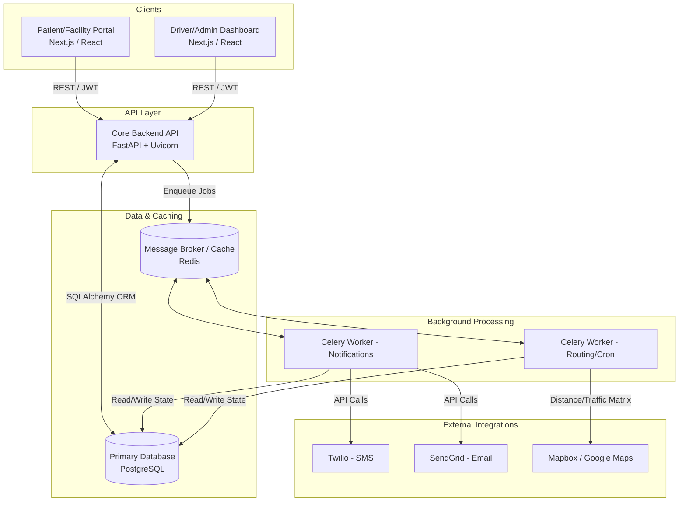
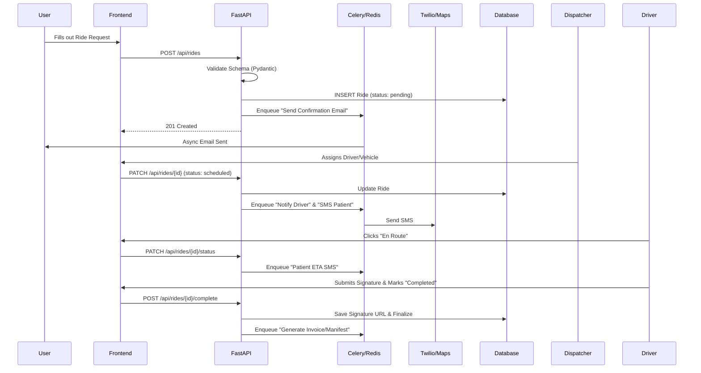
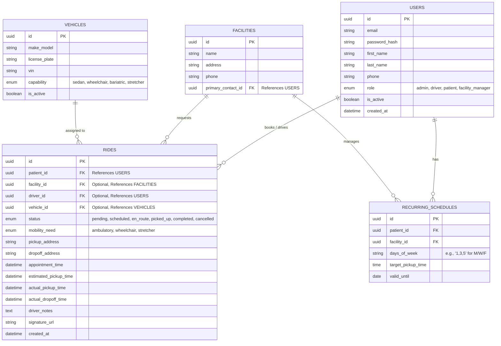

# NEMT Platform: System & Database Architecture

This document outlines the proposed production-ready architecture for the Desert Path Mobility Services platform, transitioning it from a static website into a fully operational, HIPAA-compliant web application.

---

## 1. High-Level Architecture Diagram

The system will use a modern, decoupled architecture allowing independent scaling of the frontend, backend, and background processing systems.

---

## 2. Service Responsibilities

### Frontend (Next.js / React)
- **Role:** Delivers fast, SEO-optimized marketing pages and secure, gated portals for Patients, Facilities, and Admins.
- **Responsibilities:** Client-side validation, managing authentication state (JWT), rendering dynamic dashboards (e.g., calendar views, driver manifests), and capturing electronic signatures.

### Backend (FastAPI / Python)
- **Role:** The core business logic engine. FastAPI is chosen for its native async support, high performance, and strict Pydantic data validation (crucial for healthcare data integrity).
- **Responsibilities:** Authenticating requests, authorizing roles (e.g., Driver A cannot see Driver B's trips), enforcing HIPAA compliance logs, executing CRUD operations, and offloading heavy tasks to Celery.

### Database (PostgreSQL)
- **Role:** The persistent, relational source of truth.
- **Responsibilities:** Enforcing data integrity via foreign keys, managing concurrent transactions (e.g., ensuring two dispatchers don't assign the same vehicle simultaneously), and storing JSONB for flexible data like audit logs.

### Background Jobs (Redis + Celery)
- **Role:** Handles asynchronous processing and scheduled tasks.
- **Responsibilities:** 
  - **I/O Bound:** Sending SMS confirmations, dispatching emails.
  - **CPU Bound:** Generating PDF invoices, calculating optimal routes for the fleet.
  - **Cron:** Nightly jobs to generate the next day's trips based on recurring schedules.

---

## 3. Data Flow: Booking to Completion

---

## 4. Database Schema Design

A clean, relational schema is vital. Below is the proposed entity relationship for the core system.

### Key Schema Design Decisions:
1. **Single `USERS` Table with Roles:** Allows a patient to become a facility manager or vice versa without duplicating identity data.
2. **`mobility_need` vs `capability`:** The Ride dictates the `mobility_need`. The backend scheduling logic ensures that a Ride is only assigned to a Vehicle whose `capability` matches or exceeds the need.
3. **Nullable Operational Fields:** `driver_id` and `vehicle_id` are nullable in the `RIDES` table because a ride starts in a `pending` state before it is assigned.
4. **Auditability:** Timestamp fields (`actual_pickup_time`, `actual_dropoff_time`) are strictly decoupled from `appointment_time`. This difference is exactly what Medicaid and brokers audit for on-time performance metrics.

## User Review Required
> [!IMPORTANT]
> Please review this architecture and schema. 
> 
> **Open Questions:**
> 1. Do you plan to handle **payments** (Stripe/Credit Card) directly on the platform for private-pay rides, or is this strictly billed through insurance/facility invoicing? If so, we will need to add a `BILLING` or `INVOICE` table.
> 2. Are there any specific integrations required immediately (e.g., an existing CRM, a specific Medicaid broker portal API like Modivcare)?
> 
> Let me know if you approve of this foundation, and I can begin setting up the backend structure.
